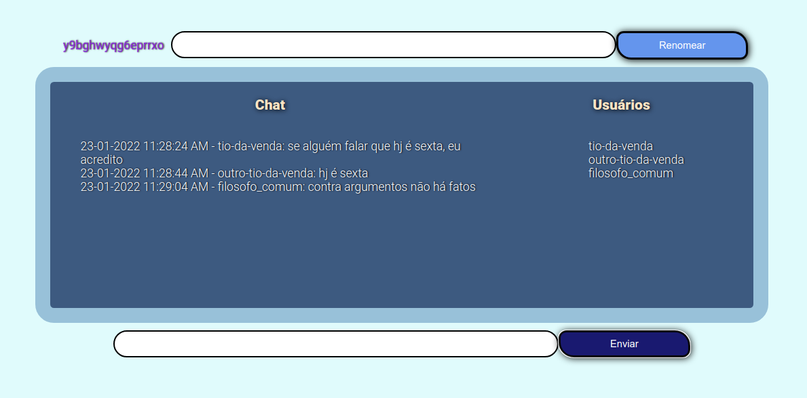

# Boas vindas ao repositório do projeto WebChat!

Esse projeto foi desenvolvido com NodeJs, MongoDB, JS vanilla, HTML, CSS e SocketIo.
O propósito é por em prática os conhecimentos nessas stacks.

O projeto WebChat, faz justamente o que o nome evidencia, simula um chat via web onde todos os usuários online são listados e interagem simultaneamente.

  
  
  
  
  
  

# Sumário

- [Habilidades](#habilidades)
- [Instruções](#instruções)
- [Entender o projeto](#entender-o-projeto)
- [Exemplo](#exemplo)
- [Avisos Finais](#avisos-finais)
- [Obrigado](#obrigado)
- [Contato](#contato)

---

&nbsp

# Habilidades

- Desenvolvimento de server socket com SocketIo;

- Trabalhar com eventos no SocketIo;

---

&nbsp

# 👀 Instruções:

Utilize o comando:

~~~
npm install
~~~

---

&nbsp

# Entender o projeto

Ao se conectar no server via comando:

~~~
node server.js
~~~

O acesso se dará pelo 'localhost:3000', lá terá dois campos para preenchimento:

O primeiro para renomear seu usuário e essa mudança será vista por todos;

Segundo para enviar uma mensagem para todos presentes na sala!

A área de usuários ira listar todos que estão online e a atualização será real-time;

&nbsp

# Exemplo

&nbsp

# Avisos Finais

Há algumas implementações a serem feitas e o projeto não visa simular o funcionamento de um webchat em sua totalidade, mas colocar em prática o conhecimento nas áreas informadas no início deste README.

Este mini-projeto está em aberto e pode ser revisado, sinta-se livre para colaborar!

&nbsp

# Obrigado

Obrigado por acompanharem até aqui e que este repositório possa servir de base para outros projetos!

&nbsp

# Contato

  <a href = "mailto:artur.alvaro73@gmail.com">
   

